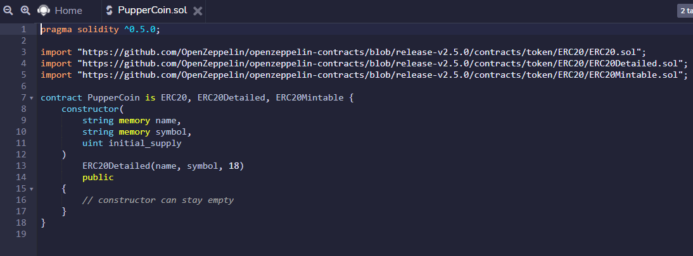
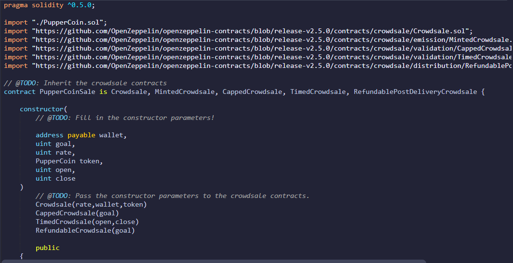
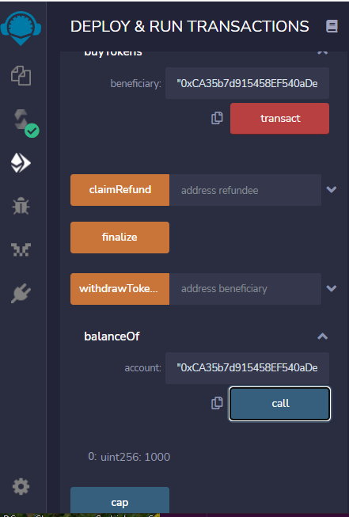
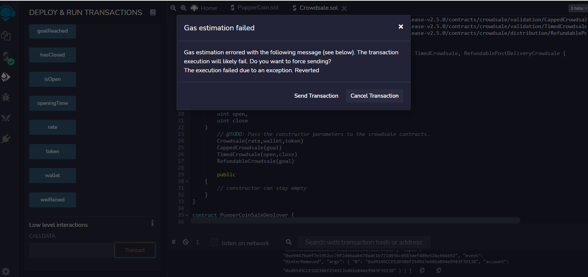

# PupperCoin

The goal of this excercise is to deploy the sale of a new token or coin based on the Ethereum network.

The new coin, dubbed PupperCoin, is first minted and then deployed for sale by a series of Etheruem contracts based upon the ERC20 Ethereum contract standard.They were all coded in Solidity on the ReMix coding platform.

The first contract is called PupperCoin - it is a basic ERC20 smart contract that is used to mint the PupperCoin.

The second contract is a combination of two contracts - a crowdsale contract that has within it another contract, that is used to deploy both the PupperCoin and Crowdsale contracts onto the Remix platform. Then the contracts can be used to actually mint and trade PupperCoin.

Both contracts compiled easily and were able to be deployed in the test JavaScript Environment.

However, when trying to go into the Kovan Test Network and executing the contract either through MyCrypto or Metamask, an error arose.It was a gas estimation fail.

I was not sure if this was because of a lack of test eth in my account or another reason. So while the contracts seem viable, I will need more work to make them deploy onto wallet platforms.

